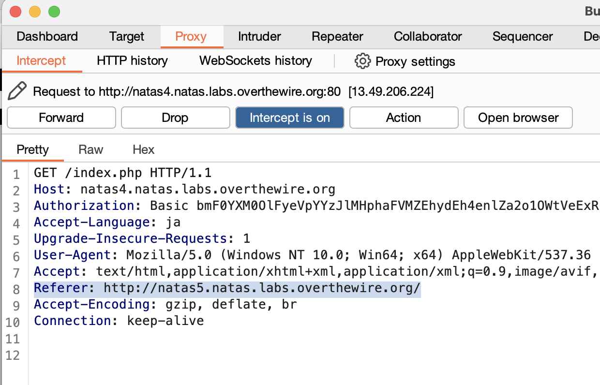

# Natas4
```
Username: natas4
Password: QryZXc2e0zahULdHrtHxzyYkj59kUxLQ
URL:      http://natas4.natas.labs.overthewire.org
```
アクセスすると  
`Access disallowed. You are visiting from "" while authorized users should come only from "http://natas5.natas.labs.overthewire.org/"`  
と、「Natas5のページから来た人しか見せないよ！」と言われる。  
Natas5から来たように偽装するには、
## 方法1 Devtool


## 方法2 BurpSuite
BurpSuiteを使用し、送信される内容を偽装する。  
1. ProxyタブからOpen browser
2. 開いたChromiumで http://natas4.natas.labs.overthewire.org へアクセス
3. `Intercept is off`を押して`Intercept is on`にする
4. `Referer:http://natas5.natas.labs.overthewire.org`と編集し、`Forward`を押す

5. アクセスが許可され、Natas5のパスワードが表示される。

```
0n35PkggAPm2zbEpOU802c0x0Msn1ToK
```