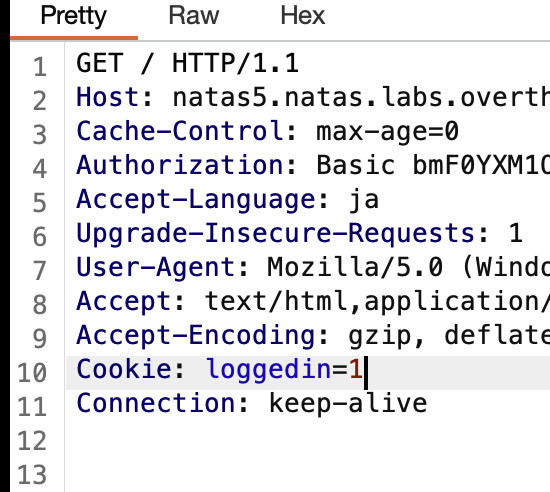

# Natas5
```
Username: natas5
Password: 0n35PkggAPm2zbEpOU802c0x0Msn1ToK
URL:      http://natas5.natas.labs.overthewire.org
```
`Access disallowed. You are not logged in`「ログインしていないから見せないよ！」と言われている。  
と言ってもログイン情報を入力するところがないので

Cookieに`loggedin`という怪しいクッキーがある。  
この値を書き換えてログイン状態だと偽装する。　　
## 方法１　Devtool
Devtoolの`Application`タブに`Cookies`とあり、その中に`loggedin`という名前のクッキーがある。  
Valueを`0`→`1`に書き換えページを更新する。

## 方法2 BurpSuite
BurpSuiteでInterseptし、  
`Cookie: loggedin=0`を`1`へ変更し、Forwardする。  


```
0RoJwHdSKWFTYR5WuiAewauSuNaBXned
```